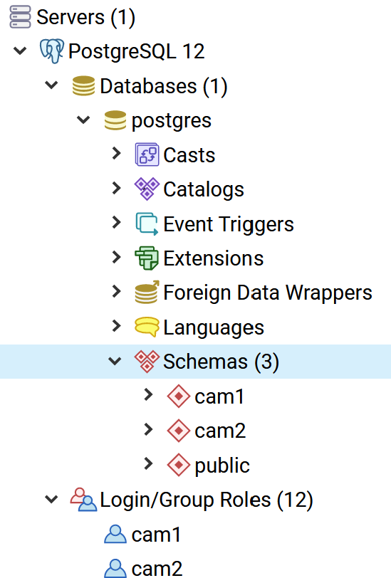

# two-camunda-instances
Maven parent with two modules, each creating a complete separate camunda BPM instance (cam1/cam2) against PostgreSQL.

DB schemas, db credentials and web portal users used are *cam1/cam1* and *cam2/cam2*

Runs against PostgreSQL. Database schemas **cam1** and **cam2** with permissions for the users need to exist. 

Schemas will be created automatically.

The web applications of the two instance will be on http://localhost:8081/cam1 and http://localhost:8082/cam2

### Essential Config
**spring.datasource:** and **camunda:bpm:database:** sections in
[application.yaml](cam1instance/src/main/resources/application.yaml) for cam1 and
[application.yaml](cam2instance/src/main/resources/application.yaml) for cam2

Also see: https://docs.camunda.org/manual/latest/user-guide/spring-boot-integration/configuration/#camunda-bpm-application

(Inspiration: https://stackoverflow.com/questions/58196241/can-i-have-two-spring-boot-camunda-applications-in-same-db-with-different-schema)
